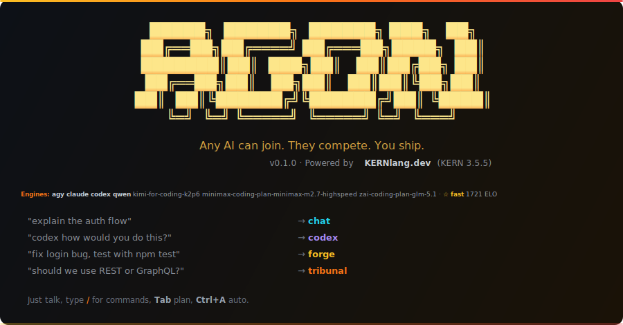

# Agon AI

<p align="center">
  
</p>

<p align="center">
  = 22">
  
  
  
</p>

**The competitive multi-AI orchestration CLI.**

Agon AI pits the world's best AI engines against each other to solve your software engineering problems. Multiple AI engines compete in isolated git worktrees on the exact same task, the best solution wins and is applied automatically, and Glicko-2 ratings continuously track each model's performance over time. 

```bash
npm install -g @kernlang/agon
```

---

## Table of Contents

- [What is Agon?](#what-is-agon)
- [Requirements](#requirements)
- [Installation](#installation)
- [Core Modes](#core-modes)
- [Interactive REPL](#interactive-repl)
- [Rooms](#rooms)
- [Using Agon from Other CLIs](#using-agon-from-other-clis)
- [Engines](#engines)
- [Cesar Routing](#cesar-routing)
- [Configuration](#configuration)
- [Architecture](#architecture)
- [License](#license)

---

## What is Agon?

<p align="center">
  
</p>
<p align="center"><sub>The <code>agon</code> REPL on launch — your roster, and plain prompts routed to the right mode.</sub></p>

Agon AI fundamentally changes how developers interact with AI coding assistants. Instead of relying on a single model and hoping for the best, Agon introduces **competitive orchestration**. You describe the task once, and Agon dispatches it to multiple models simultaneously. They race to implement the solution, and you review and apply the best outcome. 

Under the hood, Agon uses a sophisticated **worktree isolation model**. When a competition begins, Agon creates temporary, hidden git worktrees for each participating engine. This ensures that engines can modify files, run tests, and iterate without stepping on each other's toes or cluttering your main working directory. Only the winning implementation is merged back into your active branch.

Routing these tasks efficiently is **Cesar**, Agon's intelligent orchestration brain. Cesar monitors every interaction, success, and failure, updating an internal **Glicko-2 rating system** for each engine. Over time, Cesar learns which engines excel at specific task classes—like writing tests, refactoring React components, or optimizing database queries—and automatically routes future tasks to the highest-rated engine for that specific domain.

Agon isn't just about competition; it's a unified platform for AI collaboration. Whether you need engines to debate a controversial architectural decision, brainstorm solutions with weighted token allocations based on confidence, or simply execute a robust pipeline loop, Agon provides the ultimate terminal-native interface for multi-agent workflows.

## Requirements

- Node.js >= 22
- A Git repository
- At least one supported AI CLI installed globally (e.g., Claude Code, Codex, Antigravity) or an API key for API-based engines
- **Optional:** Python 3.10+ to unlock the semantic features that run as sidecars to KERN — semantic history search (`agon history --query`), tree-sitter syntax validation in forge fitness, brainstorm paraphrase dedup, and the task classifier. Agon still runs without Python; these features fall back to substring/regex paths.

## Installation

### Install from npm (recommended)

```bash
npm install -g @kernlang/agon
```

That's it — one command, no clone, no build. It pulls the engine substrate
(`@kernlang/agon-engines`) and the semantic sidecars (`@kernlang/agon-dedup`)
in automatically. Then run `agon` in any git repository to start the
interactive REPL.

```bash
# (Optional) Install the Python deps to unlock the semantic features
# (semantic history search, tree-sitter fitness, dedup, task classifier).
# The .py sidecars ship with the package; this just installs their libs.
python3 -m pip install --user fastembed numpy tree-sitter tree-sitter-python tree-sitter-typescript tree-sitter-javascript tree-sitter-json
```

### Install from source (contributors)

```bash
# 1. Clone the repository
git clone https://github.com/KERNlang/agon.git
cd agon

# 2. Install dependencies (pulls @kernlang/agon-engines + sidecars, compiles KERN → TS → JS)
npm install

# 3. Build and install the global CLI
npm run install:cli

# 4. (Optional) Install Python sidecars for semantic features
python3 -m pip install --user -r packages/dedup/requirements.txt
```

Once installed, run `agon` in any git repository to start the interactive REPL. Run `agon doctor` to verify every engine, the worktree path, and the Python sidecars resolve.

## Core Modes

Agon features multiple operational modes to suit different development challenges.

### Which mode should I use?

Pick by the **shape** of the problem, not the topic:

| You need… | Use | Why |
|-----------|-----|-----|
| Ideas / options / "what am I missing?" | **brainstorm** | Cheap and fast — engines bid confidence and surface approaches and gaps. |
| One refined output from many opinions | **synthesis** | Engines draft, improve each other's drafts over swap rounds, and a judge picks the best evolved result. |
| A decision with real tradeoffs settled | **tribunal** | Structured debate (adversarial / steelman / socratic / red-team / synthesis / postmortem) that argues the sides. |
| The whole panel on a high-stakes call | **council** | A roundtable — every engine takes a distinct role (Contrarian = top critic, Red-Team, …); a top-rated chair returns ONE verdict with a confidence + kill-switch. |
| Open exploration, no decision yet | **campfire** | Relaxed multi-engine discussion — no scoring, no winner. |
| A problem decomposed before you act | **think** | Sequential thinking — linear or reflexion (forced self-critique), optional branches; surfaces open questions + a `goal` handoff. |
| Your own decision pressure-tested | **nero** | Adversarial self-challenge — the top-rated *critic* (by tribunal rating, not the best builder) attacks it and returns a verdict. |
| A library/repo/spec/fact looked up with sources | **research** | Keyless, web-grounded, *cited* research — Agon discovers sources (npm/GitHub/MDN/IETF/Stack Overflow/Wikipedia, **no API key**), an engine drafts a grounded answer, and Agon **verifies every citation**. |
| Your **own browser** driven to research / check a page | **chrome** | Drive your real browser (navigate / read / screenshot / click) from the REPL, the CLI, or Cesar — reuses a running agon the side panel is on, else embeds a transient bridge. Needs the Agon browser extension. |
| Code built competitively against a test | **forge** | Engines race on the same task in isolated worktrees; the best test-passing patch is applied. |
| The **first** passing solution, fast | **speculate** | N engines race; the first to pass the test wins and is applied immediately. |
| A routine build with one engine | **pipeline** | Single-engine build → review → fix loop; no competition overhead. |
| A whole open-ended thing built unattended | **conquer** | Cesar drives a builder CLI (codex/claude/agy) through the build, convening nero/tribunal/council on forks, and stops at a human merge gate. The open-ended sibling to **goal**. |
| Existing code checked for bugs | **review** | Multi-engine review folded into one confidence-tiered consensus. |
| A task done end-to-end autonomously | **agent** | One engine (Cesar-routed) runs a multi-turn tool loop to do the work. |
| A whole queue driven to "done" unattended | **goal** | Per task: build → witness → gate → review + judge → commit, for hours. |
| A big, multi-layered task | **team-\*** | 2v2 / 3v3 variants of forge / tribunal / brainstorm — engines collaborate per side. |

**Rule of thumb**

- Need ideas → `brainstorm`
- Need a decision debate → `tribunal`
- Need one refined output (plan, spec, PR description, architecture note, acceptance criteria, migration plan) → `synthesis`
- Need code checked → `review`
- Need code built competitively → `forge`
- Need the first green solution fast → `speculate`
- Need a task queue executed → `goal`
- Need to think a problem through before acting → `think`
- Need your own decision attacked before you commit → `nero`
- Need a library/repo/spec/fact looked up with trustworthy, verified sources → `research`
- Need your own browser driven to research or check a page design → `chrome`
- Need the whole panel on a high-stakes, hard-to-reverse call → `council`
- Need a whole open-ended thing built unattended, away from the desk → `conquer`

**forge vs. speculate vs. synthesis** — all three run multiple engines, but they pick the winner differently:
- **forge** *scores* every candidate against the test and applies the best.
- **speculate** takes the *first* candidate that passes — fastest path to any correct answer.
- **synthesis** has engines *improve each other's* drafts and a judge picks the evolved winner — use it when there's no clean pass/fail test (plans, specs, prose, architecture).

### Forge
Competitive code generation. Engines race on the exact same task in isolated git worktrees. The winner's changes are applied automatically to your main branch.

```bash
/forge "Implement a Redis caching layer for the user service"
```

With synthesis enabled (`forgeEnableSynthesis`), a configurable **synthesizer** engine then refines the winner using the other engines' critiques into a best-of-all result — **Cesar** in the interactive REPL, the **judge** under `agon goal`, or any named engine elsewhere.

### Synthesis
Competitive cross-pollination. Engines draft independently, then improve each other's drafts in swap rounds before a judge picks the best evolved result.

```bash
/synthesis "Evolve this design doc into a concrete implementation plan" --swaps 2 --timeout 90
agon synthesis "Evolve this design doc into a concrete implementation plan" --swaps 2 --timeout 90
```

### Think
Native sequential thinking. One engine decomposes a problem into structured, numbered thoughts before any code is written — the scaffold forces it off the laziest answer. Opt-in and composable: it surfaces open questions and emits a refined spec you can hand straight to `agon goal`.

```bash
agon think "Should the rate limiter use a token bucket or a sliding window?"
agon think "Rework auth to JWT" --strategy reflexion             # force a self-critique + revision each step
agon think "Design the cache layer" --strategy tot --branches 5  # score 5 branches, keep the winner, prune the rest
agon think "Pick a storage engine" --strategy hypothesis         # competing hypotheses, eliminate the losers
agon think "..." --critic codex                                  # a SECOND engine adversarially attacks the chain
agon think "..." --json                                          # emit the ThinkResult (handoff artifact), pipe-friendly
agon goal "Close the gaps" --think --queue .gaps/ --gate "npm test"  # decompose + surface unknowns before the run
```

- **Strategies** (the method is a swappable `ThinkChain` state machine):
  - `linear` — classic sequential thinking.
  - `reflexion` — each step is force-followed by a critique then a revision (anti-laziness).
  - `tot` — tree-of-thoughts: branches self-score, the best is kept and the losers are pruned.
  - `graph` — graph-of-thoughts: branch, then merge the strongest ideas into one decision.
  - `hypothesis` — state competing hypotheses, seek discriminating evidence, eliminate the losers.
- **Steps & branches** — `--steps N` (1–20) caps the chain; `--branches N` (1–8) explores alternative paths tagged with a branch id (with scores under `tot`).
- **Adversarial critic** — `--critic <engine>` has a second engine attack the finished chain (the cross-engine check the single-model original can't do).
- **Tool-grounding** — thoughts that cite repo files which don't exist are flagged (`--no-ground` to disable), so a plan never hands `goal` phantom paths.
- **Machine-validated** — a `reflexion` chain that never actually critiques+revises is rejected by the `ThinkChain` machine.
- **Composes into other modes** — `agon goal --think` runs a decompose pass on the intent first (surfacing sub-problems + open questions, feeding a refined spec) so a long autonomous run never starts half-understood. Cesar reasons step-by-step before acting when `cesarThinkFirst` is enabled (`agon config set cesarThinkFirst true`).

### Nero
Adversarial self-challenge — Agon's answer to a devil's-advocate / evil-twin pass, but with a *real* second model instead of your own reasoning mirrored. Feed it a decision and its reasoning; a structurally adversarial critic attacks it with concrete failure scenarios (INVERSION / PRE-MORTEM / SECOND-ORDER), reports its own confidence the original is correct, and ends with a verdict: **FLAWED / PROCEED WITH CAUTION / SOUND**.

```bash
agon nero "Cache auth tokens in Redis with a 5-min TTL" --reasoning "Redis is shared across workers and fast"
agon nero "Ship the migration tonight" --confidence 80          # Nero reports its own % so you can compare
agon nero "Switch to event sourcing" --focus "replay + schema evolution"   # steer the critique
agon nero "..." --engine codex                                  # force a specific critic (skips rating selection)
agon nero "..." --json                                          # emit the NeroResult, pipe-friendly
```

- **The critic is the top-rated *adversary*, not the top-rated builder.** Selection cascades **critique → tribunal → global → random**: it prefers the dedicated `critique` discipline (a Glicko rating fed by adversarial/red-team tribunals — those *are* attack-and-refute competitions), falls back to the `tribunal` rating, then global, then a random active engine when nothing has competed yet. `agon leaderboard --mode critique` shows the standings.
- **Never grades its own homework** — the author being challenged is excluded from the candidate pool, so in-session Cesar challenges are answered by a *different* engine whenever one is available.
- **For external CLIs too** — `agon nero` (and `agon call nero "<decision>" --jsonl`) is the mode Codex / Antigravity / Claude should reach for instead of an internal self-critique; it gives them a genuinely different model as the adversary.

> **New-model cold-start (applies to all ratings).** When a new model version drops, declare its lineage in the engine JSON (`"derivedFrom": "opus-4.7"`). On its first competition it inherits the predecessor's Glicko rating instead of starting at 1500 — with **inflated uncertainty** so a genuinely better model converges fast, a **low-side clamp** (a below-average predecessor is inherited at full strength, no uncertainty bonus — you can't shed a bad rating by version-bumping), and a **min-games gate** (a near-empty predecessor rating is too noisy to inherit, so the successor starts fresh).

### Research
Keyless, web-grounded, **cited** research. The Agon edge here isn't engine competition — it's that *discovery and verification happen in Agon, around the model, with no API key*: Agon classifies the question and pulls sources from first-party endpoints that need no key (**npm registry, GitHub repo search, MDN, IETF/RFC datatracker, Stack Overflow, Wikipedia**), WebFetches them (SSRF-guarded), an engine drafts an answer grounded **only** in that content with inline `[n]` citations, and Agon then **re-fetches and verifies every citation**, flagging any that are dead, redirected to another host, or whose page doesn't mention the cited terms. The model can hallucinate a URL — it can't make Agon's fetch of that URL succeed.

```bash
agon research "how does the p-retry npm package back off?"
agon research "the WHATWG URL parsing spec" --count 8           # more sources
agon research "RFC 7231 cacheability rules" --engine codex       # force the drafting engine
agon research "what is a Merkle tree?" --json                    # emit the ResearchResult, pipe-friendly
```

- **No API key, no setup.** It never signs up for Brave/Tavily/Exa or runs a search-engine container — it talks to keyless first-party JSON APIs. A truly-general web query that has no keyless lane is reported honestly rather than answered ungrounded.
- **Citations are verified, not trusted.** Every cited URL is re-fetched; dead/redirected/mismatched ones are surfaced so you know which lines to trust.
- **For external CLIs too** — `agon call research "<question>" --jsonl` lets Codex / Antigravity / Claude get web-grounded, citation-checked answers without their own search key.

### Chrome
Drive your **own browser** from Agon — to research live pages or check a design without leaving the flow. Where `research` reads keyless source APIs, `chrome` drives the *real* browser you're logged into: it navigates, reads the rendered page, screenshots it, and (with approval) clicks and types. The agentic ReAct brain runs the turn through a loopback bridge the **Agon browser extension's side panel** attaches to — the panel lends the page tools and executes them in your Chrome.

```bash
/chrome open news.ycombinator.com and summarize the top 3 posts   # in the agon REPL
/chrome check the pricing page design — is the hero cluttered?
agon chrome "open the staging dashboard and tell me if the chart overflows"   # from the CLI
agon chrome "..." --auto-approve            # act on the page without prompting (unattended)
agon call chrome "<task>" [--auto-approve]  # machine bridge for external CLIs (Codex/Antigravity)
```

- **Reuse-or-embed, no separate terminal.** `chrome` reuses a running agon (`agon serve` or the REPL) the side panel is already attached to; if nothing's running it embeds a transient in-process bridge just for the turn and writes the 0600 connection file the panel auto-connects through. The REPL `/chrome` hosts the bridge itself, so the panel auto-connects to your live agon.
- **Your approval is the backstop.** Read-only page tools (navigate / read / screenshot) run without prompting; page-changing actions (click / type) prompt with Agon's own Y/N gate (the REPL permission UI, or a terminal prompt from the CLI). `--auto-approve` allows them unattended — required for a non-interactive caller (`agon call chrome`) to act on the page. Page content is treated as untrusted: the approval gate is the prompt-injection backstop.
- **Never Cesar.** The browser turn runs on the agentic brain, never your live Cesar session (no split-brain); its result is fed back to Cesar so the conversation builds on what the browser found. In the REPL it's also recorded for `Ctrl+R` / `agon last`.
- **Requires the Agon browser extension** with its side panel open + attached. With no panel attached, the brain answers in text only (and says so).

### Brainstorm
Engines bid their confidence level on how they would tackle a complex problem. Engines with higher confidence bids are allocated more tokens and priority.

```bash
/brainstorm "How should we handle database migrations with zero downtime?"
```

### Tribunal
Engines debate a proposed solution, argue its flaws, and attempt to reach consensus. Available modes include: adversarial, socratic, red-team, steelman, synthesis, and postmortem. The execution protocol can be parallel, chained, or hybrid; `auto` selects the mode-specific default.

```bash
/tribunal --mode red-team --protocol hybrid "Review the new authentication middleware for security flaws"
```

### Council
A roundtable of **all** your active engines — Agon's stronger answer to the viral "LLM Council" pattern. Where that runs one model wearing different hats, council seats *genuinely different models*, each in a distinct role, and chairs the panel with the top-rated engine.

```bash
agon council "Should we adopt event sourcing for the ledger?"
agon council "Rewrite the scheduler in Rust?" --engines claude,codex,agy   # constrain the panel
agon council "..." --roles "Contrarian,Red-Team,First-Principles"          # override the roles
agon council "..." --chairman claude                                       # force the chair
agon council "..." --json                                                  # emit the CouncilResult, pipe-friendly
```

- **Four moves, not a free-for-all.** (0) the chair frames a **decision brief** — options, stakes, reversibility, known evidence, what would change the answer — so every advisor argues the same thing; (1) each advisor responds **in role**; (2) an **O(N) directed peer critique** — each advisor sharpens exactly one peer (biggest blind spot, most fragile assumption, best rival option), cheaper and sharper than an N² blind round; (3) the chair returns **ONE verdict** with a confidence, the strongest counterargument, one next step, and a **kill-switch** (the evidence that would reverse it) — and must cite which critiques it accepted or rejected, so dissent can't be quietly laundered away.
- **Glicko-informed seating.** The **Contrarian** seat goes to the top-rated *critic* (the same `critique → tribunal → global` cascade Nero uses — the best builder is rarely the best critic); the **chair** is the top-rated engine overall. Roles fill in priority order: Contrarian, First-Principles, Red-Team, Outsider, Expansionist.
- **Scales to your roster.** N engines → N−1 advisors + 1 chair. With exactly 2 engines both are advisors and the configured Cesar engine chairs (with a loud "thin panel" warning). Below 2 it refuses. A single engine failing degrades the run with a warning rather than aborting it.
- **For external CLIs too** — `agon council` and `agon call council "<decision>" --jsonl` give Codex / Antigravity / Claude the full heterogeneous panel for a high-stakes call.

**council vs. tribunal** — tribunal is a 2-side structured *debate* (adversarial / steelman / …); council is a *roundtable* with named roles, a decision brief, directed critique, and a single accountable chairman verdict. Reach for council when the decision is high-stakes or hard to reverse and you want the whole panel, not just two sides.

### Campfire
A relaxed, open-ended discussion mode where engines can collaborate without competitive scoring or tight token constraints.

```bash
/campfire "Let's discuss the pros and cons of migrating to GraphQL"
```

### Pipeline
A focused, single-engine build-review-fix loop ideal for deterministic tasks where competition isn't strictly necessary.

```bash
/pipeline "Fix all ESLint errors in the src/components directory"
```

### Review
Performs an automated, multi-engine code review of your uncommitted changes, branches, or commits — then folds every engine's findings into one **confidence-tiered consensus** instead of dumping several noisy reviews side by side. Each finding carries a 0–1 confidence, and a two-signal rule decides what truly blocks: one *blocking* finding at ≥0.85, **or** two engines flagging the same issue at ≥0.70 (a nit never blocks, even at 0.99). Findings are grouped **verified / needs-check / speculative / nit**; engine timeouts and parse-failures land in their own lane (never a phantom blocker); and medium-confidence findings can go to a **judge** for a second opinion.

```bash
/review HEAD~1..HEAD
agon review commit:HEAD                         # all active engines in parallel
agon review commit:HEAD --engine claude        # explicit single-reviewer fast path
agon review commit:HEAD --engines claude,codex # explicit subset
agon review branch:feat-x --base main        # feat-x's commits vs main, regardless of checkout
agon review range:main...feat-x              # fully explicit two-ref scope
```

Diff scope is deliberate, never implicit: `--base <ref>` pins the base for `uncommitted`/`branch:` targets, and `range:BASE...TARGET` names both ends. A failed reviewer seat (timeout / hard error) is auto-retried once at half the wall clock before it's reported — and every failure is named in the run summary, never silently folded into a smaller panel. The same retry + loud `panel degraded:` banner applies to brainstorm, tribunal, and council seats.

Standard Review deliberately uses the full active panel even when the legacy `reviewDefaultEngine` preference is configured. Narrowing requires `--engine` or `--engines`. Explicit subsets are strict: an unknown, unavailable, or removed engine aborts the request instead of silently changing the committee.

### Agent
An autonomous agent loop that can operate solo or in shadow mode, automatically routed to the best engine by Cesar based on task requirements.

```bash
/agent "Investigate the memory leak in the worker process and fix it"
```

### Speculate
Parallel speculation where N engines attempt to solve a problem in isolated worktrees, and the first successful, test-passing winner is immediately applied.

```bash
/speculate --engines 3 "Write a script to backfill the missing user avatars"
```

### Team Competitions
Team-based variants of core modes (e.g., 2v2 or 3v3). Includes Team Forge, Team Tribunal, and Team Brainstorm for complex, multi-layered tasks.

```bash
/team-forge "Rewrite the frontend to use Tailwind CSS"
```

### Goal
Autonomous, long-running orchestration. You hand Agon a finite, checkable task queue (e.g. a directory of gap specs) plus a green **gate** command, and it drives the whole queue to completion unattended — for hours. The value isn't "every engine succeeds"; it's the **gated competitive loop**: only clean, passing, test-witnessed patches ever land, even if half the panel times out or gets superseded.

**How it works — the per-task loop.** For each task, on a dedicated `goal/<id>` branch (never `main`):

1. **Worktree** — a fresh throwaway worktree is checked out at the base commit. *All engine activity — implement and review — runs inside this worktree; the repo you launched Agon from is never touched.* Any failure discards the worktree wholesale (atomic rollback).
2. **Implement** — forge races the engine roster in parallel. When you don't pin `--engines`, Cesar routes the roster per task (a single engine for a trivial gap, the full panel for a real feature) and escalates ambiguous/expensive tasks to the judge.
3. **Pick the winner** — *test-aware* selection: a passing patch that adds a test beats a higher-scoring one that doesn't (so the witness always has something to witness).
4. **Witness** — the new test must **fail on the base commit and pass on the new one** — no no-op tests.
5. **Mutation-witness** — canonical mutants on the changed lines must die, defeating tautological "encode the answer" tests (the highest-EV way to cheat a gate).
6. **Gate** — the frozen green oracle (your `--gate`) runs once from the worktree. It's snapshotted at start so a task can't weaken it.
7. **Review** — **all** review engines grade the diff in parallel; their findings are folded by a confidence-tiered **consensus** (verified / needs-check / speculative / nit) under a two-signal block rule. A **judge** adjudicates only the medium-confidence "needs-check" set. Flaky or empty engines land in a separate **failures lane** — they can't impersonate a blocker.
8. **Fix** — a verified blocker triggers one bounded fix pass, then re-gate + re-review.
9. **Commit** — only now does **one commit per task** land on the goal branch (CAS-safe). A task that can't pass **parks** with the reason and a saved gate log, and the run moves on.

The run is **journaled and resumable** (`--resume`), checkpoints cleanly on Ctrl-C, **meters real spend** (implement + the whole review panel + judge), and **never auto-pushes** by default — you review the commits and open the PR.

```bash
agon goal "Close all KERN gaps" \
  --queue .kern-gaps/ \
  --gate "npm run build && npm run typecheck && npm test" \
  --branch goal/close-gaps \
  --require-tests --max-attempts 3 \
  --max-hours 8 --budget 5 --push
```

**Flags / guardrails for a long run:**

| Flag | Purpose | Default |
| --- | --- | --- |
| `--queue` | Task source: a directory (one task/file) or a `.jsonl` of `{id,source,dependsOn,verify}` | required |
| `--gate` | Green-oracle command — the authoritative pass/fail, frozen at start | required |
| `--branch` | Goal branch (`goal/<id>`) — **never `main`** | `goal/<id>` |
| `--engines` | Implementer roster; **authoritative** when set (no routing/narrowing) | all active |
| `--review-engines` / `--judge` | The review panel and the adjudicator | all / config→Cesar→first |
| `--require-tests` | Reject a source change with no test | on |
| `--oracle-gate` | Pre-flight oracle red-team (`off`\|`warn`\|`strict`): the panel tries to GAME each task's `verify`; `strict` refuses to launch if any is gameable | `off` |
| `--max-attempts` | Attempts per task before park | `3` |
| `--max-hours` / `--budget` | Wall-clock and/or USD ceiling — either, both, or neither | off (`0`) |
| `--push` / `--pr` | Push the goal branch per task / open a PR via `gh` at the end (never `main`). With `--push`, the run ends with an engine-written PR title/body and a **prefilled GitHub PR link** — click it and the form is already filled (no `gh`/token needed) | off |
| `--resume` / `--status` / `--dry-run` | Resume from journal / print a run's digest / plan only | — |

Read a run's digest from any session with `agon goal --status --id close-all-kern-gaps`. Reachable from external CLIs via `agon call goal "<intent>" --queue <dir> --gate "<cmd>"`.

**Designing the gate — it _is_ the spec.** The forge only optimizes to make your `--gate` (and each task's `verify`) pass, so that command is the actual specification. Make it **discriminating**: it must FAIL a plausibly-wrong implementation, not merely pass the intended one (use distinct/edge inputs — `atan2(3,4)`, not `atan2(0,1)`). Before a long run, red-team your own oracle with `agon nero "<the gate I wrote>" --reasoning "is this gameable?"` — if a wrong impl can slip through, add a killer case first. A non-discriminating gate lets buggy-but-passing code land green and dead-loops the run.

Or **automate the red-team**: `--oracle-gate=warn` (or `strict`) runs a pre-flight where the review panel tries to make each task's `verify` pass with a *cheating* impl (hardcode, ignore inputs). If any engine succeeds, the verify is gameable — `warn` reports it and continues, `strict` refuses to launch so you strengthen it first. It's the discriminating-oracle discipline built into the tool, so it no longer depends on remembering to dogfood it.

### Conquer

Supervised-autonomous **build** of an open-ended task. Where `agon goal` optimizes code to pass a discriminating oracle (great for narrow, verifiable tasks), **conquer** targets the open-ended work you _can't_ pre-oracle — "build me a whole tool." Cesar drives a pluggable builder CLI (codex / claude / agy) in agent mode, turn by turn, while you're away from the desk.

```bash
agon conquer "Build a CSV-import tool with quoted-field handling" --gate "npm run build && npm test"
agon conquer "..." --builder codex -e claude,agy   # pick the builder + the advisor panel
agon conquer "..." --max-turns 60 --max-hours 4     # bound the run
agon conquer "..." --push                           # on success, commit + push its isolated branch
```

- **Cesar consults on forks.** When the builder hits a genuine fork it emits `CONQUER_ASK: <question>`; Cesar classifies it and convenes the _cheapest sufficient_ panel — `nero` (quick), `tribunal` (a choice), `brainstorm` (open), `council` (high-stakes) — then feeds back a compact verdict. A normal agent loop re-prompts itself with the same blind spots; conquer brings the whole heterogeneous panel to bear.
- **A layered done-oracle, not a self-claim.** On `CONQUER_DONE: <claim>` the cheap deterministic layers run first — the `--gate` command (L0), a diff acceptance-drift check that blocks weakened/rewritten existing tests (L1), and an empty-claim guard (L2). Only when those pass does the **evidence-based falsifier** run (L4/L5): a _tool-enabled_ critic clones the working tree into a throwaway sandbox, reads the real code and runs commands to hunt a counterexample, then Cesar **mechanically re-runs** that counterexample in the sandbox and blocks "done" _only_ when it actually reproduces a failure — never on a bare opinion or confidence score. The adversary's findings are surfaced to your merge gate whether or not they blocked. A red gate, a weakened/tampered test, or a _verified_ counterexample blocks "done."
- **Runs in an isolated worktree.** conquer creates a persistent `conquer/*` branch and worktree from `HEAD`, so the builder never edits your source checkout and uncommitted source changes are not silently included. The final summary prints both locations and the cleanup command.
- **Stops at a human merge gate.** conquer never auto-merges to main. By default it leaves the isolated branch and worktree for you to review; `--push` commits + pushes that branch, then prints an **engine-written PR title/body** (from the real branch diff) and a **prefilled GitHub PR link** (`…/compare/…?quick_pull=1&title=…&body=…`) — click it, the form is already filled, review + merge. No `gh` CLI or token needed. `--push` additionally **refuses protected branches** (`main`/`master` by default; override with `protectedPushBranches` in config) — if the worktree HEAD somehow resolves to one, the work stays committed locally for a human push. The done-oracle is irreducible for open-ended work, so the human merge gate is load-bearing — it holds the original product intent no automated layer can reconstruct.

Also available as interactive `/conquer` in the REPL (with full CLI flag parity: `--max-turns`, `--gate-timeout`, `--max-hours`, `--timeout`) and `agon call conquer` for external CLIs.

## Interactive REPL

Launching `agon` starts a powerful terminal REPL equipped with native scrollback, command history, and a file rail. 

Available commands include: `/forge`, `/synthesis`, `/brainstorm`, `/tribunal`, `/campfire`, `/pipeline`, `/review`, `/agent`, `/speculate`, `/team-forge`, `/status`, `/leaderboard`, `/history`, `/config`, `/plan`, `/models`, `/engines`, `/doctor`, `/help`, and `/exit`.

**Example Session:**
```text
$ agon
Agon > /leaderboard
1. Claude        (Glicko: 1650)
2. Codex         (Glicko: 1590)
3. Antigravity   (Glicko: 1540)

Agon > /forge "Extract the routing logic into a separate module"
[Cesar] Routing to Claude and Codex based on Glicko.
[Forge] Initializing isolated worktrees...
[Forge] Engines are racing...
[Forge] Claude completed in 45s.
[Forge] Codex completed in 52s.
[Forge] Winner: Claude. Applying patch...
Agon > 
```

## Rooms

Rooms let multiple live CLIs — you, other Codex/Claude/agy sessions, even Agon's own engines — talk in **one shared, persistent transcript**. Unlike a one-shot orchestration run, a room stays open: anyone can join, post, and read the history. It's how independent agents coordinate, hand off work, or ask each other for help in the same repo.

The transcript *is* the protocol — an append-only NDJSON ledger under `~/.agon/rooms/<room>/` — so any CLI (or a plain shell script) can participate.

```bash
# In one terminal — join and follow the room live
agon room join design --as claude --engine claude
agon room tail design

# In another terminal — another agent posts
agon room post design --as codex --engine codex -m "file-first is the right MVP @claude"

# Anytime
agon room read design   # full transcript (--since <seq> for new-only)
agon room who design    # who's present + unread/mention counts + the lock table
agon room leave design --as claude   # clear your presence
agon room list          # all rooms
```

Messages are human-mediated by default (you post when prompted), `@callsign` mentions are parsed, and presence tracks who's around. `agon room post design "quick reply"` also works — `-m` is optional when the message is positional. Add `--json` to `read`/`tail` (JSON lines) or `who` (one JSON object) for scripts and monitors.

**Never work a stale board.** Every member has a **read cursor**: `agon room read design --unread --as codex` returns only what you haven't seen and advances your cursor (add `--peek` to look without advancing). `room who` shows each member's unread/mention counts, so "is anyone behind?" is one command. Agents should run an `--unread` read at the start of every turn — via CLI or MCP `RoomRead(callsign, unreadOnly, markRead)`.

**Resource locks.** Claim a file/branch/task so two agents never collide, with a TTL so a forgotten lock can't go stale forever:

```bash
agon room lock design -r packages/core --as codex --ttl 30   # claim for 30 min
agon room release design -r packages/core --as codex          # done — free it
agon room lock design -r packages/core --as claude --steal    # take over an EXPIRED lock (audited, @mentions the stale holder)
```

Locks are ordinary ledger events (`lock`/`release`/`lock-steal`), so the lock table in `room who` can never disagree with the transcript; posting while you hold an expired lock warns you to release it.

**Autonomous mode.** An agent can watch a room and reply on its own turn until a stop condition:

```bash
agon room auto design --as claude --engine claude --until-human   # respond until a human jumps in
```

It's **safe by design**: mention-only by default (add `--open-floor` to respond to anything), a one-poster-at-a-time **turn lease**, hard caps (`--max-turns`, default 3; `--max-minutes`, default 10), and a **ping-pong halt** that stops two auto-agents from looping. Use `--dry-run` to exercise the loop without spending tokens.

MCP-capable engines can also use the [room tools](#using-agon-from-other-clis) (`RoomJoin`/`RoomPost`/`RoomRead`/`RoomLock`/`RoomRelease`/…) instead of the CLI.

## Using Agon from Other CLIs

Agon can also be called from other AI CLIs such as Claude Code, Codex, and Antigravity.

### One-step setup

Run this **once** to wire Agon into every AI CLI on your machine:

```bash
agon install-agent-prompts
```

It drops the native lightweight integration for each detected CLI:

| CLI | Installed files | Invoke |
| --- | --- | --- |
| Codex | `~/.codex/skills/agon/SKILL.md` and `~/.codex/skills/agon/agents/openai.yaml` | `$agon` in a new Codex session |
| Antigravity (agy) | `~/.antigravitycli/commands/agon.toml` | `/agon` |
| Claude Code | `~/.claude/commands/agon.md` | `/agon` |

Each prompt or skill teaches the engine to call Agon from its own shell. No MCP, no always-on tokens: nothing runs until you invoke it. Target specific CLIs with `--cli codex,agy,claude`, preview with `--dry`, or refresh an existing integration with `--force`.

After that, in Claude Code or Antigravity:

```
/agon evolve this design doc into a concrete implementation plan
```

In Codex, start a new session so skills reload, then use:

```
$agon evolve this design doc into a concrete implementation plan
```

The engine runs `agon agent-guide` to learn the modes, then picks the right one — forge, synthesis, brainstorm, tribunal, campfire, review, or goal.

### Or call Agon directly

Any CLI that can run a shell command can call Agon straight away — no setup needed:

```bash
agon synthesis "Evolve this design doc into a concrete implementation plan" --swaps 2 --timeout 90
agon call tribunal "Should we ship this architecture?" --team --tribunalMode red-team
agon call brainstorm "How should we design the plugin API?" --team
agon call review
agon call forge "Implement the cache layer" --test "npm test" --team
agon call synthesis "Evolve this design doc into a concrete implementation plan" --swaps 2 --timeout 90
```

`agon call` streams the underlying Agon workflow into the caller's terminal, so the calling CLI can show live progress and the other engines' output. Use `--jsonl` when the caller wants machine-readable lifecycle events:

```bash
agon call tribunal "Debate the migration plan" --team --jsonl
```

### MCP (heavier alternative)

For MCP-capable clients, Agon also ships a stdio MCP server. It currently runs **from a source checkout** (the MCP server isn't bundled with the npm install yet) — point the command at your clone:

```bash
claude mcp add -s user agon -- node /path/to/Agon-AI/plugins/agon-orchestrator/scripts/agon-mcp.js
codex mcp add agon -- node /path/to/Agon-AI/plugins/agon-orchestrator/scripts/agon-mcp.js
```

After that, clients can call Agon tools such as Tribunal, Brainstorm, Forge, Campfire, Pipeline, and Review directly — plus the **room** tools (`RoomJoin`, `RoomPost`, `RoomRead`, `RoomWho`, `RoomLeave`, `RoomList`), so an MCP engine can join a [room](#rooms) and chat without shelling out. (MCP is request/response, so poll `RoomRead --since <seq>` to follow a room.)

## Engines

Agon doesn't ship its own model — it **orchestrates the AI coding CLIs you already have**. The more engines you install and authenticate, the more competitors forge can race, the broader the review panel, and the better Cesar can route. To "get the most out of it," set up several.

### 1. Install the engine CLIs

Each engine is a separate CLI you install once. Built-ins (in `engines/*.json`):

| Engine | Install | Auth |
| --- | --- | --- |
| **Claude** (Anthropic) | `npm install -g @anthropic-ai/claude-code` | `claude` then `/login` (subscription) or `ANTHROPIC_API_KEY` |
| **Codex** (OpenAI) | `npm install -g @openai/codex` | `codex` then sign in, or `OPENAI_API_KEY` |
| **Antigravity** (Google) | `curl -fsSL https://antigravity.google/cli/install.sh \| bash` | `agy` then sign in, or `GOOGLE_API_KEY` |
| **Kimi Code** | `curl -fsSL https://code.kimi.com/kimi-code/install.sh \| bash` | `kimi` then `/login` |
| **OpenCode** | `curl -fsSL https://opencode.ai/install \| bash` | `opencode auth login` (provider keys) |
| **Aider** | `pip install aider-chat` | provider API key |
| **Ollama** (local) | [ollama.com/download](https://ollama.com/download) | none (runs locally) |
| **OpenRouter** | `npm install -g openrouter-cli` | `OPENROUTER_API_KEY` |
| **Mistral** / **Qwen** | `pip install mistral-cli` / `qwen-cli` | provider API key |

Subscription/CLI-authed engines (Claude, Codex, Antigravity, Kimi Code, OpenCode) bill through their own login — no API key needed in your environment. The rest read an API key from the env var shown above.

### 2. Verify what Agon can see

`agon doctor` is the source of truth — it probes each engine's binary, auth, and capabilities:

```bash
agon doctor engines     # which engines are installed + reachable (binary/key/login)
agon doctor review      # smoke-test that each engine returns parseable review output
agon doctor harness     # Cesar routing: selected engine + tool reliability
```

Anything that shows `ok` is available to forge, review, and goal. Engines that fail are simply skipped (and quarantined in the review failures lane), so a missing CLI never breaks a run.

### 3. (Optional) Add API-based engines

Beyond the built-in CLIs, you can register any OpenAI- or Anthropic-compatible API endpoint — including provider "coding plans" — by dropping a JSON file in `~/.agon/engines/`. No code, no rebuild; Agon loads it on next launch.

```jsonc
// ~/.agon/engines/my-coding-plan.json
{
  "schemaVersion": 3,
  "id": "my-coding-plan",
  "displayName": "My Coding Plan",
  "isLocal": false,
  "tier": "user",
  "timeout": 180,
  "exec":   { "args": [] },
  "review": { "args": [] },
  "api": {
    "baseUrl": "https://api.example.com/v1",
    "apiKeyEnv": "MY_PLAN_API_KEY",   // read from this env var
    "model": "the-model-id",
    "maxTokens": 16384,
    "format": "anthropic"             // "anthropic" or "openai"
  }
}
```

Set the key (`export MY_PLAN_API_KEY=…`), then confirm with `agon doctor engines`. Built-in definitions live in the repo's `engines/` directory; your own go in `~/.agon/engines/` and override built-ins of the same id. Toggle availability and per-engine default models from there or via config (`engineModels`).

## Cesar Routing

**Cesar** is Agon's built-in orchestration layer. By default, you don't need to choose which engine to use; Cesar automatically routes your prompts to the best-performing engine based on historical Glicko-2 ratings tailored to specific task classes.

If you want manual control, you can easily override Cesar's routing:

```bash
# Override for a single command
/forge --engine claude "Update the README"

# Manually switch the active engine for the session
/cesar agy
```

## Configuration

Global configuration, engine selection, model preferences, and telemetry settings are managed via your personal config file located at `~/.agon/AGON.md`. Project-specific settings can be defined in a local `AGON.md` within your repository.

### Commit attribution & PR text

Every commit agon itself creates (`conquer --push`, each `goal` task commit, the REPL's `/commit`) ends with a Claude-Code-style attribution block:

```
⚔️ Forged by [Agon](https://github.com/KERNlang/agon)

Co-Authored-By: agon (KERN) <292465531+KERN-Agon@users.noreply.github.com>
```

PR bodies agon writes end with the same line rendered with the **real AGON logo** — the [KERN-Agon](https://github.com/KERN-Agon) account's avatar (`github.com/KERN-Agon.png`), since PR bodies render markdown while commit messages are plain text. Upload the AGON wordmark as that account's profile picture once and it powers both the contributor avatar and the PR footer.

- **One opt-out switch:** set `commitCoAuthor` to `""` (machine-wide in `~/.agon/config.json` or per-project in `.agon.json`) to disable the whole block — banner and trailer, commits and PR bodies. Mirrors Claude Code's `includeCoAuthoredBy`.
- **Contributor-graph credit:** the default email is the [KERN-Agon](https://github.com/KERN-Agon) GitHub account's noreply address, so GitHub renders agon as a real co-author avatar on every commit it builds. To credit a different account, set `commitCoAuthor` to that bot's `<id>+<login>@users.noreply.github.com`.
- **PR text:** after a `--push`, one engine call turns the branch's actual diff + commits into a clean PR title/body (Summary / Changes / Verification), printed in the terminal and baked into a prefilled GitHub compare link — clicking it opens the new-PR form already filled in. If the engine call misses, agon falls back to its templated digest; the push itself never depends on it.

## Architecture

Agon is built using **KERN**, a structured meta-language that compiles down to optimized TypeScript. Nearly the entire codebase — including Ink screens, signals, blocks, and orchestration logic — is authored in `.kern` files and regenerated via `npm run kern:compile`. The monorepo:

- `packages/core` — types, config, Glicko-2 + Team Elo scoring, Cesar routing, session state (100% KERN, 69 files)
- `packages/cli` — the interactive REPL, Ink surfaces, command handlers (~99% KERN, 60+ files)
- `packages/forge` — competitive worktree orchestration, fitness, M-of-N quorum finalize (100% KERN, 17 files)
- `packages/adapter-cli` — CLI engine integrations (100% KERN)
- `packages/dedup` — Python sidecars for semantic features (history search via fastembed/MiniLM, tree-sitter syntax validation, task classifier, brainstorm paraphrase dedup). Bridged from KERN via JSON over stdin/stdout — KERN imports Python where Python is strictly better than a TS/JS port.
- `packages/mcp` — exposes Agon's orchestration modes as MCP tools so other CLIs (Claude Code, Codex, Antigravity) can drive Agon

The entire project is ESM, uses strict TypeScript, and is thoroughly tested with Vitest.

## License

This project is licensed under the MIT License.
